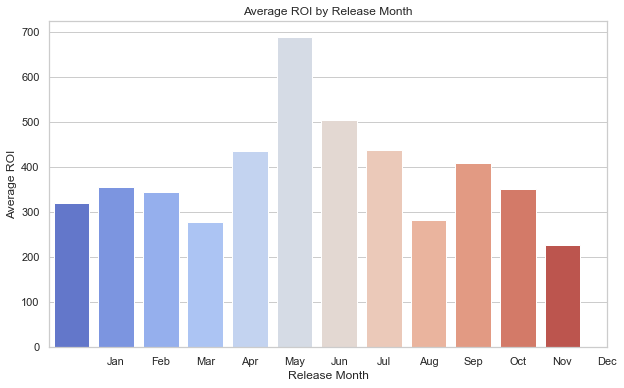

# EXPLORATORY DATA ANALYSIS FOR MOVIE INDUSTRY.
Microsoft plans to start a new film production company, but lacks experience. Researchers researched box office genres and turned findings into valuable information for the CEO to choose movies.

# Project Details.
The aim for this project was to help the organisation perform better as they get into the space. 

I used the following data:
* imdb.title.basics
* imdb.title.ratings
* tn.movie_budgets

I took time to perform some exploritory analysis and came up with some business recommendations for the company. 
I did the analyses guided by the following research questions;
1. What are the specific genres or storylines that resonate well with audiences and are successful.
2. Are there specific release windows or seasons that tend to generate higher box office revenues.
3. Which movies have had the highest ROI(Return On Investment) on Production Budgets and box office earnings.

# Conclusion.
Based on my findings, I was able to conclude on the following;

1. The top three performing genres are Drama, Documentaries, and Comedy; with Drama being the most prefered to a larger population.

2. The runtime of movies really did not affect the popularity or preference of the movies. This meant that the population preference was not fueled by the runtime.

3. High of the revenues were achieved in the summer Season this is explained by the school vacations, holidays, and increased leisure time.

4. The highest revenues by month were achieved in May, a month before Summer showing the preparations of many for the summer season.

5. Other high revenues are seen in the Month of November where we know that the customers are also getting ready for the chrismas festivities. 
6. The revenues are extremely low in the months of January and September indicating that they are the busiest times for many customers with jobs, school, and othe things that take away leisure time.

7. The ROI is not interfered whether the budget is increased or not. 

8. The ROI similar to the revenues is equally affected by the release months and seasons.
  

9. Over time, the ROI has had fluctuations with no clear trend. This could be due to many external factors with the leading being the economic conditions, changes in audience prefereces or the success of indivindual movie releases.

# Business Recommendations.
after my conclusions, here are some of the recomendations that I can give to the company;

1. **Focus on Drama, Documentaries, and Comedy Genres**: As Drama is the most preferred genre among the audience and Documentaries and Comedy also perform well, consider investing more resources and efforts in producing movies in these genres. They have proven to be popular choices and are likely to attract a larger audience.

2. **Flexible Runtimes**: Since the runtime of movies did not significantly affect the popularity or preference, you have the flexibility to explore various runtime options based on the story and creative vision of each film. This allows for more creative freedom without worrying about runtime constraints.

3. **Strategic Release Timing**: Plan your movie releases strategically to coincide with peak seasons, such as the summer months and November before Christmas. These periods tend to have higher revenues, driven by increased leisure time and holiday festivities. Consider scheduling major releases during these times to maximize box office success.

4. **January and September Release Strategy**: Recognize that January and September are busy months for many customers, and the leisure time may be limited due to work and school commitments. Therefore, consider adjusting the release strategy during these months, focusing on genres that appeal to a more niche audience or smaller budget films.

5. **Budget and ROI Management**: Since the ROI does not seem to be significantly affected by the budget, be cautious about overspending on production costs. Focus on optimizing budget allocation and ensure prudent financial management without compromising the quality of the films.

6. **Adaptability to Market Fluctuations**: Recognize that the ROI has shown fluctuations over time, potentially influenced by various external factors. Stay agile and adaptable to changing market conditions, economic shifts, and audience preferences. Continuously monitor industry trends and adjust your film production and marketing strategies accordingly.

By implementing these recommendations, Microsoft's new movie studio can make informed decisions and position itself for success in the dynamic and competitive movie industry.